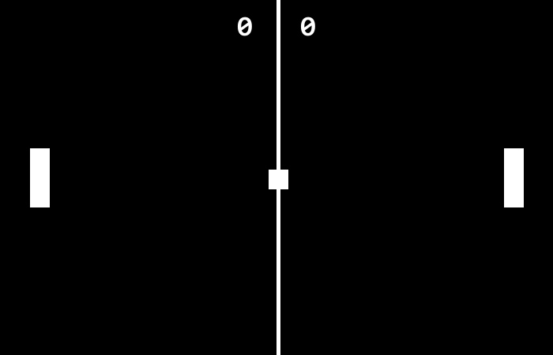

# Pypong
 A simple Pong clone made with Pygame! 
 
 The intention of this project is to familiarize myself with Pygame and some of the structures and techniques used in gamedev. Therefore, I plan to add some experimental from features time to time!

 ## Screenshots
 

 ## Mentions
 All the sounds used in this game have been downloaded from freesound:
 * __Clank from two clay pots.wav__ by [Ironlink15](https://freesound.org/people/Ironlink15/)
 * __beep4.wav__ by [thisusernameis](https://freesound.org/people/thisusernameis/)
 * __Coins 1__ by [ProjectsU012](https://freesound.org/people/ProjectsU012/)
 * __Goal Point Reached Simple SFX__ by [Free-Rush](https://freesound.org/people/Free-Rush/)
 * __Collect_Point_00.wav__ by [LittleRobotSoundFactory](https://freesound.org/people/LittleRobotSoundFactory/)
 * __Tennis smash__ by [gprosser](https://freesound.org/people/gprosser/)
 * __backhand_close.wav__ by [singintime](https://freesound.org/people/singintime/)
 * __guiclick.ogg__ by [farpro](https://freesound.org/people/farpro/)
 * __Button_Hover (ogg).ogg__ by [deadsillyrabbit](https://freesound.org/people/deadsillyrabbit/)